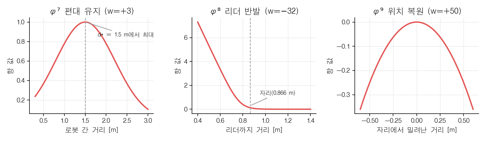
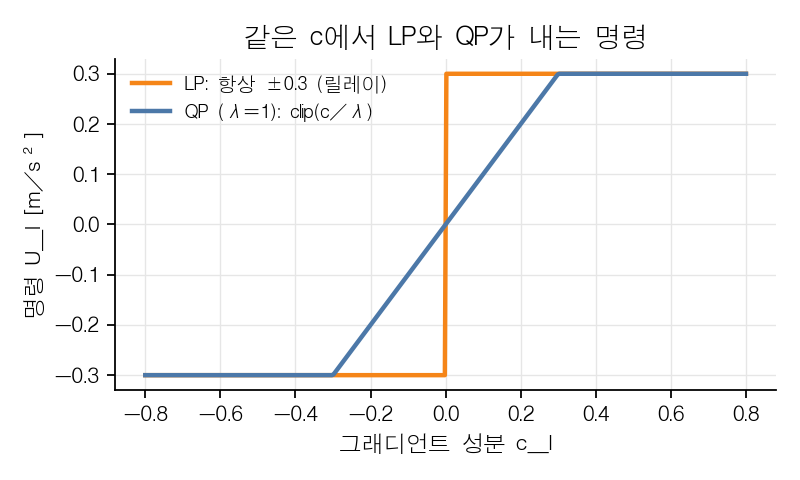
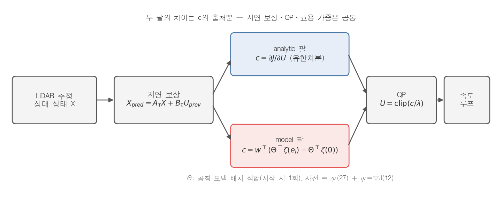
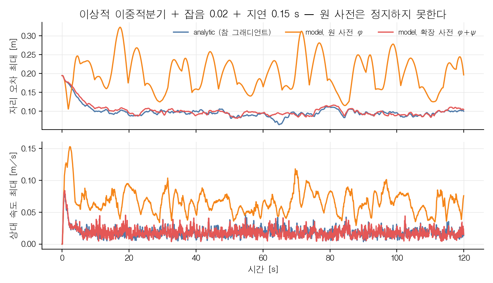
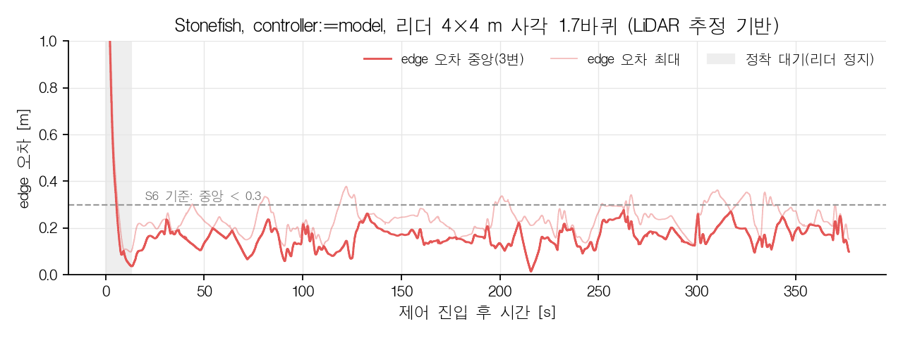
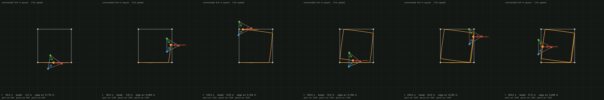
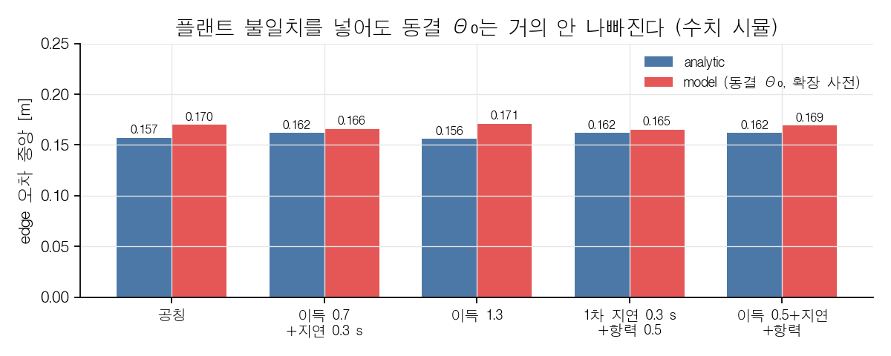
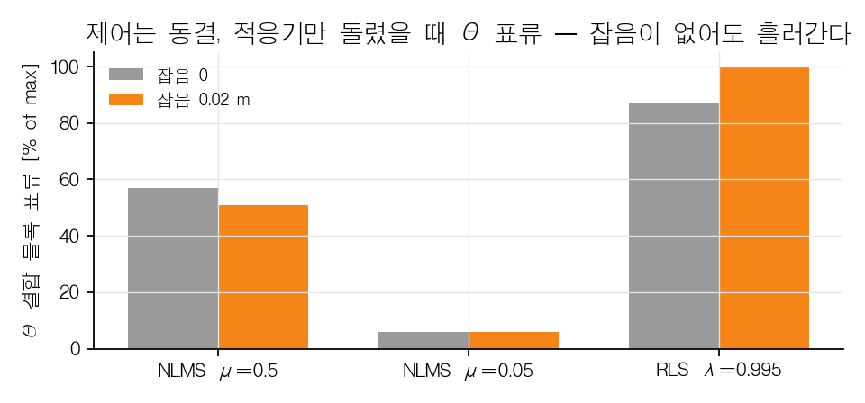

# Koopman 모델 제어 팔 — 무엇을 왜 바꿨고, 어디까지 확인했나

2026-10-06. 처음 듣는 사람을 기준으로 쓴 설명 노트. 수식은 꼭 필요한 것만, 코드 위치는 괄호 안에. 그림은 `draft/fig/`(생성 스크립트 `draft/fig/mkfig.py`, 그림 6은 `results/2026-10-06/` 탑뷰 영상 프레임).

---

## 0. 요약

편대 제어 명령이 **식별된 Koopman 모델 Θ를 거쳐** 나오도록 `model` 제어 팔을 다시 만들었다.

**왜 원논문 방식은 안 됐나.** 원논문은 Θ를 0에서 시작해 워밍업 동안 로봇을 흔들며 배운다. 그런데 배워야 할 숫자는 1477×27개인데 워밍업 표본은 200~600개뿐이라, 데이터가 없는 방향의 Θ는 아무 값이나 된다. 제어가 시작되면 로봇은 워밍업 때 가 본 적 없는 상태로 들어가고, 거기서 Θ가 내는 명령은 엉터리라 발산했다.

**왜 원논문 사전 그대로는 정지하지 못했나.** Θ를 제대로 구해도, 모델이 낼 수 있는 명령은 "현재 상태의 1차식"뿐이다. 그런데 이 효용함수는 자리 근처에서는 살살, 멀어지면 세게 미는 식으로 상태에 따라 모양이 바뀐다. 1차식으로는 그 모양을 못 따라가서 감쇠가 4~10배 약하게 나오고, 로봇이 자리 주변을 0.2~0.3 m씩 떠돈다.

**그래서 바꾼 것 두 가지.** (1) 효용함수와 동역학은 우리가 알고 있으니, 로봇을 움직이지 않고 수식으로 표본 수천 개를 만들어 Θ를 **미리 맞춰 둔다**. (2) 모델이 보는 변수에 효용의 **기울기 ψ**를 추가한다. 그러면 "어느 쪽으로 밀어야 점수가 오르나"가 변수 안에 직접 들어 있어 1차식으로도 정확해진다. 이 둘로 Stonefish에서 analytic 팔과 같은 성능이 나왔다(4×4 m 사각 경로, edge 오차 중앙 0.16 m).

**온라인 적응은 왜 뺐나.** 제어 중에도 Θ를 계속 배우게 해 봤는데 두 가지가 걸렸다. 첫째, 추력 이득·지연·항력을 바꿔도 미리 맞춘 Θ의 성능이 거의 안 변해 **배워서 얻을 것이 없었다**. 둘째, 제어 중에는 명령 U가 상태의 함수라 "상태 때문에 변한 것"과 "명령 때문에 변한 것"을 데이터로 구분할 수 없다. 그래서 잡음이 없어도 Θ가 엉뚱한 방향으로 흘러가 발산했다. 자세한 수치는 §8.

**지금 노드가 쓰는 것(2026-10-06 이후).** 기울기 ψ를 변수에 넣는 것은 "답을 변수에 넣어 둔" 동어반복이라(§9·§10), 노드의 `model` 팔은 **원논문 형태**(효용항 φ만, bilinear, 데이터로 맞춘 Θ, 1-step QP)로 되돌렸다. 그 틀 안에서 가장 뾰족한 효용항 φ⁴를 빼고 Θ를 궤적 위에서 세 번 누적 재적합해, 정상 오차 0.12~0.14 m(analytic 0.08 m)까지 올렸다. 남은 차이는 1차식 모델의 표현력 한계다(§11).

---

## 1. 문제 설정 — 무엇을 제어하나

리더(플랫폼) 1대와 팔로워(gtbot) 3대. 팔로워는 리더 기준 **상대 좌표**로 정해진 자리(정삼각형, 변 1.5 m, 리더로부터 0.866 m)를 지켜야 한다.

상태는 세 로봇의 상대 위치와 상대 속도를 한 벡터로 묶은 것이다.

$$
X = \begin{bmatrix} p_1 \\ p_2 \\ p_3 \\ v_1 \\ v_2 \\ v_3 \end{bmatrix} \in \mathbb{R}^{12},
\qquad
U = \begin{bmatrix} a_1 \\ a_2 \\ a_3 \end{bmatrix} \in \mathbb{R}^{6},\ |U_l| \le 0.3\ \mathrm{m/s^2}
$$

동역학은 이중적분기로 가정한다(20 Hz, $\Delta t = 0.05$ s).

$$
X(k+1) = A\,X(k) + B\,U(k),\qquad
A = \begin{bmatrix} I & \Delta t\, I \\ 0 & I \end{bmatrix},\ 
B = \begin{bmatrix} \tfrac{1}{2}\Delta t^2 I \\ \Delta t\, I \end{bmatrix}
$$

(`sim/dynamics.py`)

---

## 2. 효용함수 — "좋은 상태"를 점수로

로봇 $i$마다 아홉 개의 점수 항 $\varphi^{(1)}_i \dots \varphi^{(9)}_i$를 두고, 가중합을 전체 효용 $J$로 쓴다.

$$
J(X) = \sum_{i=1}^{3}\sum_{j=1}^{9} w_j\, \varphi^{(j)}_i(X)
$$

| 항 | 뜻 | 가중치 $w_j$ |
|:---|:---|:---|
| $\varphi^{(1)}$ | 속도가 목표 쪽을 향하면 + (방향만 본다) | −1 |
| $\varphi^{(2)}$ | 지시 속도에서 벗어나면 − | −1 |
| $\varphi^{(3)}, \varphi^{(4)}$ | 목표 자리에 가까우면 + | +5, +2 |
| $\varphi^{(5)}$ | 작업 영역 벽에 붙으면 − (반경 50 m라 사실상 꺼짐) | −2 |
| $\varphi^{(6)}$ | 다른 로봇과 너무 가까우면 − | −2 |
| $\varphi^{(7)}$ | 로봇 간 거리가 1.5 m에 가까우면 + (**편대 유지**, 이 논문의 추가 항) | +3 |
| $\varphi^{(8)}$ | 리더(플랫폼)에 너무 가까우면 − (기준 거리 0.65 m) | −32 |
| $\varphi^{(9)}$ | 자리에서 밀려난 거리의 제곱 − (복원력) | +50 (값 자체가 음수) |

예를 들어 편대 유지 항은

$$
\varphi^{(7)}_i = \sum_{j:(i,j)\in E} \exp\!\left(-\frac{(\lVert p_i - p_j\rVert - 1.5)^2}{\sigma^2}\right),\quad \sigma = 1.0
$$

거리가 정확히 1.5 m면 1점, 멀어지거나 가까워지면 깎인다. (`sim/utility.py`, 가중치는 `relative_state.py`의 `make_scenario`)



*그림 1. 편대 유지·리더 반발·위치 복원 항의 모양. φ⁷은 1.5 m에서 봉우리, φ⁸은 자리(0.866 m) 안쪽에서 급히 커지는 장벽, φ⁹은 자리를 중심으로 한 포물선이다.*

---

## 3. 제어 법칙 — 두 팔이 공유하는 부분

매 틱 "다음 스텝 효용을 가장 크게 하는 U"를 고른다. 다음 스텝 효용을 U에 대해 1차로 근사하면

$$
J\big(X(k+1)\big) \approx \underbrace{J(AX)}_{\text{U와 무관}} + c^{\top} U,
\qquad
c_l = \frac{\partial}{\partial U_l} J(AX + BU)\Big|_{U=0}
$$

$c$는 "방향 $l$로 1만큼 밀면 점수가 얼마나 오르나"를 담은 6차원 벡터다. 여기에 추력 크기 벌점을 붙인 QP를 풀면 해가 공식 한 줄로 나온다.

$$
U^{*} = \arg\max_U \Big( c^{\top}U - \frac{\lambda}{2}\lVert U\rVert^2 \Big)
\;\Rightarrow\;
U^{*} = \mathrm{clip}\!\left(\frac{c}{\lambda},\ -0.3,\ +0.3\right),\quad \lambda = 1.0
$$

(`sim/control.py` `solve_input`) 벌점이 없는 LP는 항상 ±0.3 풀추력(릴레이)이 되어 지연과 만나면 한계사이클이 났고, 이것이 QP로 바꾼 이유다.



*그림 2. 같은 c에 대해 LP는 부호만 보고 ±0.3을 내고, QP는 c에 비례해 민다. 작은 오차에서 살살 미는 쪽이 지연·잡음에 강하다.*

작동 지연 보상도 공통이다. 실측 지연 $\tau = 0.16$ s만큼 상태를 미리 전파한 뒤 $c$를 구한다.

$$
X_{\text{pred}} = A_\tau X + B_\tau\, U_{\text{prev}}
$$

**두 팔의 차이는 오직 "c를 어떻게 구하나"다.**



*그림 3. 제어 파이프라인. 상태 추정 → 지연 보상 → (analytic 또는 model이 c를 냄) → QP → 속도 루프. 두 팔은 c의 출처만 다르다.*

| 팔 | $c$의 출처 |
|:---|:---|
| `analytic` (기본값) | 효용함수 $J$를 직접 유한차분: $c_l = [J(AX + B h e_l) - J(AX)]/h$ |
| `model` | 식별된 bilinear Koopman 모델 $\Theta$로 다음 스텝 $\varphi$를 예측해서 그 차로 |

---

## 4. Koopman 모델 팔 — 리프팅과 bilinear 모델

**리프팅**: 상태 $X$에 효용 항 값들을 덧붙여 확장 상태 $z$를 만든다.

$$
z = \begin{bmatrix} z^{(1)} \\ z^{(2)} \end{bmatrix},\qquad
z^{(1)} = X \in \mathbb{R}^{12},\qquad
z^{(2)} = \big[\varphi^{(1)}_1, \dots, \varphi^{(9)}_3\big] \in \mathbb{R}^{27}
$$

$z^{(1)}$의 전이는 정확히 선형이고($X^+ = AX + BU$), 비선형은 전부 $z^{(2)}$에 있다. 원논문은 $z^{(2)}$의 전이를 동작점 둘레 2차 Taylor 전개로 쓰되 $U$의 2차항을 버려 **U에 대해 1차(bilinear)**로 만든다.

$$
z^{(2)}(k+1) \approx \Theta^{\top}\zeta(k),\qquad
\zeta = \begin{bmatrix}
\tilde z^{(1)} \\ \tilde z^{(2)} \\ U \\ 1 \\
\tilde z^{(1)}\!\otimes\!\tilde z^{(1)} \\ \tilde z^{(1)}\!\otimes\!\tilde z^{(2)} \\ \tilde z^{(2)}\!\otimes\!\tilde z^{(2)} \\
\tilde z^{(1)}\!\otimes\! U \\ \tilde z^{(2)}\!\otimes\! U
\end{bmatrix},
\qquad \tilde z = z - z_0
$$

$z_0$는 동작점(목표 편대 배치, U=0), $\otimes$는 모든 쌍의 곱이다. $U\otimes U$ 항이 없으므로 예측은 U에 대해 1차이고, 따라서 $c$가 바로 나온다.

$$
c_l = w^{\top}\Big(\Theta^{\top}\zeta(z, e_l) - \Theta^{\top}\zeta(z, 0)\Big)
$$

(`sim/koopman.py` `build_zeta`, `sim/control.py` `input_objective`) 이 $c$를 §3의 QP에 넣으면 끝이다. **Θ가 c를 낸다**는 것이 "Koopman 기반 제어"의 뜻이다.

원논문은 Θ를 워밍업 구간에 로봇을 흔들어 얻은 데이터로 RLS(재귀최소자승)로 학습한다.

---

## 5. 왜 기존 model 팔은 발산했나

이 저장소의 기록(`research/sim-results.md`)과 이번 재현 모두 같은 결론이다.

- 원 사전에서 $\zeta \in \mathbb{R}^{1477}$, 즉 Θ의 크기는 $1477 \times 27$인데 워밍업 표본은 200~600개 → **미결정계**. (확장 사전 §6.2에서는 $\zeta \in \mathbb{R}^{2497}$, Θ는 $2497 \times 39$.) 데이터가 없는 방향의 Θ는 아무 값이나 된다.
- 워밍업은 로봇을 초기 위치 근방에서 흔드는데, 제어가 시작되면 시스템은 학습 분포 밖으로 나간다(**외삽**).
- 결과: 이상적 이중적분기 시뮬에서도 전 변형이 발산, Stonefish에서는 54~147 m 발산(기존 기록).

그래서 저장소는 analytic 팔로 전환해 모든 결과를 냈고, Koopman 식별은 S2 진단(bilinear가 linear보다 1-step 예측이 좋은가)에만 남아 있었다. 원고의 "identification and LP pipeline reused unchanged"와 그림 2의 "RLS online"은 이 실제 경로와 맞지 않았다 — 이번 작업의 출발점이다.

---

## 6. 무엇을 바꿨나 — 세 가지

### 6.1 Θ를 공칭 모델로 미리 적합한다 (Θ₀)

우리는 효용함수와 이중적분기를 알고 있으므로, 로봇을 움직이지 않고도 "이 상태에서 이 명령이면 다음 $\varphi$가 얼마인가"를 계산할 수 있다. 동작 영역(자리 ±0.3 m, 속도 ±0.15 m/s)에서 표본 1500개를 뽑아 배치 정칙화 최소자승으로 Θ를 푼다.

$$
\Theta_0 = \arg\min_\Theta \sum_k \big\lVert \Theta^{\top}\zeta_k - z^{(2)}_{k+1}\big\rVert^2 + \lambda_r \lVert\Theta\rVert_F^2
\;=\; (Z^{\top}Z + \lambda_r I)^{-1} Z^{\top} Y
$$

원논문도 $\hat\Theta(k_0)=\Theta_0$를 "선택된 초기 추정"으로 두고 배치 최소자승(식 3.36)을 언급하므로 틀 안이다. 표본마다 $U$와 $-U$를 쌍으로 넣는데, 이러면 제어가 읽는 입력 결합 블록이 상태 전용 잔차와 직교 분리된다. 정칙화는 $\lambda_r = 0.1$이다.

**정칙화가 장식이 아닌 이유.** 확장 사전에서 미지수는 열당 2497개인데 표본 1500개 × ±U 쌍 = 회귀 행 3000개라 겨우 결정계다. $\lambda_r = 10^{-6}$(종전 RLS의 $P_0 = 100I$ 상당)이면 데이터가 약한 방향의 Θ가 풀려 평형 위치가 적합 시드마다 크게 흔들렸다. (`sim/experiment.py` `nominal_theta`)

### 6.2 사전(dictionary)에 효용 그래디언트를 추가한다

6.1만으로는 안정은 되지만 **정지하지 못하고 0.03~0.07 m/s로 떠돌았다**(edge 오차 0.23~0.39 m). 원인을 야코비안으로 재면 분명하다.

| | 감쇠 $\partial c/\partial v$ 고유값 | 위치 강성 $\partial c/\partial p$ 고유값 |
|:---|:---|:---|
| 참 그래디언트 | −2.4 ~ −6.0 | 전부 음수 |
| bilinear 모델(원 사전) | −0.2 ~ −0.7 | **+3.4** 하나 양수 |

bilinear 모델에서 $c$는 $\tilde z$에 **아핀**이다. 그런데 이 효용함수의 그래디언트는 게이트(시그모이드)와 장벽(지수)으로 상태에 따라 모양이 바뀌어, 아핀으로는 담기지 않는다. 감쇠가 4~10배 약하고 불안정 방향이 하나 생기니 로봇이 자리 근처를 배회한다.



*그림 4. 이상적 플랜트에서 세 제어기의 자리 오차와 상대 속도. 원 사전(주황)은 0.15~0.3 m를 오가며 정지하지 못하고, 확장 사전(빨강)은 analytic(파랑)과 겹친다.*

해법은 Koopman에서 늘 하는 것 — **사전을 키운다.** 효용 그래디언트 $\psi = \nabla_X J \in \mathbb{R}^{12}$를 관측량으로 덧붙인다(가중치 0).

$$
z^{(2)} \leftarrow \big[\varphi_1^{(1)},\dots,\varphi_3^{(9)},\ \psi_1,\dots,\psi_{12}\big] \in \mathbb{R}^{39}
$$

이러면 다음 스텝 효용의 U-응답이 $\psi\otimes U$에 정확히 선형이 된다.

$$
J(AX + BU) - J(AX) \approx \nabla J^{\top} B U = \sum_l \Big(\Delta t\,\psi_{v,l} + \tfrac{1}{2}\Delta t^2\,\psi_{p,l}\Big) U_l
$$

Θ가 배울 것은 괄호 안의 계수, 즉 **입력 이득**뿐이다. 모델 $c$와 참 $c$의 코사인 유사도가 1.000이 됐다. ($\psi$는 중심차분 $h = 10^{-5}$, analytic 팔의 $c$는 전진차분 $h = 10^{-4}$로 계산한다.) (`Scenario.grad_lift`, `sim/utility.py` `z2_vector`)

### 6.3 제어 중에는 Θ를 동결한다

제어 중 RLS 갱신은 §8처럼 식별이 안 돼 발산했으므로 뺐다. 지금 model 팔은 시작 시 Θ₀를 7.5 s에 적합하고, 이후 틱당 2 ms로 $c$만 계산한다(이 두 값은 이 머신에서 1스레드로 잰 실행 시간이다).

---

## 7. 검증 결과

**수치 시뮬** (이중적분기, 잡음 0.02, 지연 0.15 s; 정착 후 edge 오차 중앙 / 최대, m)

| 제어 팔 | 결과 |
|:---|:---|
| analytic | 0.155 / 0.176 |
| 기존 model (Θ₀=0, 워밍업 학습) | 발산 |
| 공칭 Θ₀, 원 사전 | 0.23~0.32 / 0.24~0.39 (적합 시드에 민감, 배회) |
| **공칭 Θ₀, 확장 사전** | **0.13~0.17 / 0.16~0.20** (시드 2개, 플랜트 2종 모두) |

**Stonefish** (LiDAR 추정 기반 출력 피드백, `controller:=model`; edge 오차 중앙 / p90 / 최대, m)

| 조건 | model | analytic |
|:---|:---|:---|
| 리더 정지, 1회 | 0.164 / 0.285 / 0.393 | 0.164 / 0.258 / 0.405 |
| 리더 정지, 2회 | 0.134 / 0.289 / 0.379 | — |
| **리더 4×4 m 사각 1.7바퀴 (377 s)** | **0.163 / 0.265 / 0.378**, est 유효율 100 %, 무충돌 | (미실행) |

S6 게이트 기준(중앙 < 0.3, p90 < 0.6, 무충돌)을 넘는다. 영상·CSV는 `results/2026-10-06/`.



*그림 5. Stonefish 4×4 m 사각 런의 편대 변 오차. 코너(약 60 s 간격)에서 0.3 m대로 올라갔다가 직선에서 0.1~0.15 m로 돌아온다.*



*그림 6. 같은 런의 탑뷰 스냅샷(40 s 간격). 회색 사각형이 지령 경로, 주황이 리더 궤적, 세 점이 팔로워, 변의 붉기가 편대 변 오차다.*

**주의 — 수조 벽.** 8×8 m 사각(기본 경로)과 직선 30 m 런은 두 팔 모두 리더 7.4 m 지점에서 깨졌는데, 플랫폼이 원점에서 출발하고 수조 반지름이 약 8 m라 벽에 닿은 것이다. 제어기와 무관하다. 4×4 m는 수조 안에 들어간다.

---

## 8. 온라인 적응은 왜 뺐나

"실기는 추력이 시뮬과 다르니 제어 중 적응하면 좋지 않을까"를 시험했다. 두 가지가 나왔다.

**첫째, 불일치가 있어도 동결 Θ₀가 거의 안 나빠진다.** 입력 이득 0.5~1.3배, 지연 2배, 항력을 넣어도 edge 오차는 0.165~0.171 m로 공칭(0.170)과 같았다. QP $U = c/\lambda$가 비례 제어처럼 순해서 이득 오차가 루프 이득만 바꾸고 평형점은 안 바꾸기 때문이다.



*그림 7. 플랜트 불일치 5종에서 analytic과 동결 Θ₀의 편대 변 오차 중앙값. 차이가 0.01 m 안쪽이다.*

**둘째, 폐루프에서는 입력 결합이 식별되지 않는다.** 제어는 동결 Θ₀로 두고 적응기만 돌려도 잡음 없는 공칭 플랜트에서 Θ가 57~87 % 표류했다. $U = \mathrm{clip}(c(X)/\lambda)$는 상태의 함수라 $\zeta$ 안에서 $U$ 블록과 상태 블록이 공선이고, 디더 ±0.03은 평시 $|U|$ 중앙값(0.03)과 같은 크기라 이를 못 푼다. 갱신 블록 제한·투영·지연 정렬로도 안 됐다.



*그림 8. 제어는 동결 Θ₀로 두고 적응기만 돌렸을 때 입력 결합 블록의 표류. 잡음을 0으로 해도 57~87 % 흘러가므로 잡음이 아니라 폐루프 공선성이 원인이다.*

| 방식 | 결과 |
|:---|:---|
| 틱마다 Θ 온라인 갱신(원논문) | 식별 불능 → 발산 |
| 느린 NLMS(μ=0.05) | 표류 6 %로 안정하지만 배우는 것도 없음 |
| 실기 워밍업에서 입력 이득·지연을 배치 식별 후 동결 | 가능한 대안, 이득은 작을 것 |

---

## 9. 솔직한 한계

1. **확장 사전은 "동어반복" 비판을 받을 수 있다.** $\psi$가 참 그래디언트이므로 Θ가 배우는 것은 입력 이득뿐이다. 형식은 식별된 Koopman 모델이지만 정보량은 analytic 팔과 같다. 논문에는 이를 방법으로 명시해야 한다.
2. **Θ는 공칭 모델의 합성 표본으로 적합한다.** 실로봇 데이터·온라인 갱신이 아니다. 원고의 "updated online by RLS"는 여전히 제어 경로에 해당하지 않는다.
3. **Stonefish 검증은 약식이다.** 팔당 1~2회이고, 정식 S6 절차(2회 연속)와 사각 경로의 analytic 대조는 아직 없다. 이 환경에서 ros2 CLI가 토픽을 못 봐 `koopman.csv`의 GT 열로 계산했다.
4. **기본값은 그대로 `analytic`이다.** `controller:=model`을 줘야 Koopman 팔이 돈다. 실기 런치(`hardware_platform.launch.py`)는 인자를 안 넣어 analytic 고정이다.

---

## 10. 왜 다음 단계가 "사전 재설계"인가 — 불변성과 내다보기 실측

리뷰(Shi et al., *Koopman Operators in Robot Learning*, T-RO 2026, §V-C)는 사전의 품질을 1-step 잔차가 아니라 **Koopman 불변성**으로 재라고 한다. 지표는 consistency index

$$
I_C = \lambda_{\max}\!\left(I - K_F K_B\right),\qquad K_F = \Psi(Y)\Psi(X)^{\dagger},\ K_B = \Psi(X)\Psi(Y)^{\dagger}
$$

0이면 사전의 모든 함수가 다음 스텝에도 사전 안에서 선형 예측되고, 1이면 어떤 함수는 전혀 예측되지 않는다. 상수·공선 열(φ⁵는 벽 반경 50 m라 상수 0)로 생기는 자명한 1을 피하려고 Ψ(X)의 수치적 열공간으로 내려 계산했다(`tools/koopman_consistency_index.py`).

| 영역 | 흐름 | X만 | 원 사전 [X; φ] | 확장 사전 [X; φ; ψ] |
|:---|:---|:---|:---|:---|
| ±0.3 m, ±0.15 m/s | U=0 표류 | 0.000 | 0.004 | 0.004 |
| | QP 폐루프 | 0.007 | 0.062 | **0.177** |
| | 고정 u=+0.3 | — | 0.170 | 0.189 |
| ±0.1 m, ±0.05 m/s | QP 폐루프 | 0.060 | 0.224 | **0.346** |

**확장 사전이 불변성은 더 나쁘다.** ψ는 φ⁴·φ¹ 같은 날카로운 항의 미분이라 φ보다 더 뾰족하고, 그 다음 스텝 값은 선형으로 예측되지 않는다(열별 상대오차 상위: ψ 속도 성분 0.22~0.31, φ⁴ 0.18~0.24). 제어가 읽는 "J의 U-응답" 하나만 정확히 선형이 되었을 뿐이다. §9의 동어반복 비판이 수치로 확인된 셈이다.

이것이 제어에 어떻게 나타나는지는 **다스텝 MPC**로 보인다. Θ로 H스텝 효용을 내다보는 MPC와, 모델 오차 없이 참 효용함수로 내다보는 MPC(상한)를 1-step QP와 비교했다(수치 시뮬, 리더 사각 경로 0.1 m/s·30 s마다 90° 코너, `tools/koopman_mpc_lookahead.py`).

| 제어기 | 코너 station 최대 / 중앙 [m] | 정상 station [m] | 틱당 계산 |
|:---|:---|:---|:---|
| 1-step QP (analytic) | 0.138 / 0.109 | 0.095 | ~0 ms |
| 1-step QP (Koopman Θ) | 0.150 / 0.118 | 0.099 | 2 ms |
| Koopman MPC H=3 | 0.287 / 0.235 | 0.342 | 240 ms |
| Koopman MPC H=5 | 0.277 / 0.184 | 0.166 | 560 ms |
| Koopman MPC H=10 | 발산 | — | — |
| **참 모델 MPC H=5** | **0.087 / 0.075** | **0.066** | 116 ms |
| 참 모델 MPC H=10 (+리더 preview) | 0.084 / 0.069 | 0.066 | 507 ms |

두 가지가 동시에 보인다. **내다보기 자체는 이득이 있다** — 코너 과도응답 −37 %, 정상 −30 %, H=5에서 포화, 리더 경로 preview는 더 보태지 않는다(이득은 자기 관성을 미리 계산해 일찍 감속하는 데서 온다). 그러나 **지금 Θ로는 그 이득을 못 얻는다** — H≥3이면 1-step보다 나빠지고 H=10은 발산한다. Θ로 z⁽²⁾를 재귀 예측하면 $I_C$만큼 오차가 매 스텝 쌓이기 때문이다.

참 모델 MPC는 비선형 최적화라 틱당 116 ms로 20 Hz에 못 들어간다. 모델이 bilinear면 같은 문제가 QP가 되어 실시간이 된다 — **Koopman이 analytic을 이길 수 있는 자리가 여기다.** 그 자리를 채우려면 재귀 예측이 서는 사전, 즉 $I_C \ll 0.1$인 사전이 필요하고, 그 전제는 효용함수가 매끄러워지는 것이다(φ⁴ 폭 0.05 m 스파이크, φ¹의 코사인·게이트, φ⁸의 exp(−20d) 장벽이 원인). 순서는 효용함수 평활화 → 불변성 좋은 사전(범용 기저, consistency 최소화) → 충분한 데이터로 Θ → H=5 Koopman MPC다.

---

## 11. 논문 형태로 되돌리기 — 지금 노드의 model 팔

§6.2의 ψ 확장은 c를 정확하게 만들지만 §9·§10이 보인 대로 동어반복이고 불변성도 나쁘다. 그래서 노드의 `model` 팔을 **원논문 형태**로 되돌리고, 그 틀 안에서 성능을 끌어올렸다(2026-10-06). 형태는 사전 = 효용항 φ만(ψ 없음), ζ = 전체 bilinear(식 4.2), Θ = 공칭 플랜트 데이터의 최소자승, 제어 = 1-step QP. 바꾼 것은 두 가지다.

**(1) 효용에서 φ⁴를 뺀다.** φ⁴는 목표점 폭 0.05 m의 위치·속도 스파이크(가중 2)다. 사전 안에서 가장 뾰족한 항이라 불변성을 가장 망친다. 빼도 analytic 팔 성능은 그대로이고(정상 0.079 m, 코너 0.138 m), 원 사전의 $I_C$는 0.136 → 0.029로 내려간다. φ⁸·φ¹을 부드럽게 하는 것은 성능을 깎아 제외했다. (`sim/experiment.py` `model_scenario`)

**(2) Θ를 궤적 위에서 재적합하고, 표본을 누적한다.** 가우시안 표본만으로 맞춘 Θ(refits=0)는 발산한다 — 장벽 안쪽처럼 폐루프가 가지 않는 곳에 표본 질량을 쓰기 때문이다. 원논문이 RLS로 하는 "궤적 위 식별"에 해당하는 절차로, Θ로 공칭 폐루프를 굴려 방문 상태를 모으고 다시 맞춘다. 한 라운드만 하면 적합 시드마다 0.14~0.23 m로 흔들렸고, 라운드마다 방문 표본을 누적(3라운드 × 60에피소드 × 200틱)하면 0.118~0.136 m로 모인다. (`nominal_theta(refits=3, episodes=60)`, 적합 약 40 s)

수치 시뮬(리더 사각 경로 0.1 m/s, 잡음 0.02, 지연 0.16 s, 적합 시드 0~2 × 리더 시드 0~1):

| 팔 | 정상 station 중앙 [m] | 코너 station 최대 [m] | 모델 c 코사인 |
|:---|:---|:---|:---|
| analytic (φ⁴ 제거) | 0.079 | 0.138 | — |
| 논문 형태, 재적합 0회 | 발산 | — | — |
| 논문 형태, 재적합 1회 | 0.140~0.233 | 0.208~0.31 | 0.76 |
| **논문 형태, 재적합 3회 누적** | **0.118~0.136** | **0.215~0.277** | 0.82~0.87 |
| (참고) ψ 확장 사전 | 0.099 | 0.150 | 1.000 |

analytic과의 차이 0.04~0.06 m는 §5의 한계 — 1차식 모델이 자리 근처의 약한 밀기와 먼 곳의 센 밀기를 한 기울기로 뭉갠 것 — 가 남은 양이다. 이는 Θ를 더 잘 맞춰서 없어지는 오차가 아니라 사전의 표현력 한계이고, 더 좁히려면 §10의 순서(불변성 좋은 사전 → Koopman MPC)로 가야 한다. 이상 플랜트(잡음·지연 없음)에서는 err 0.113~0.132 m에서 완전히 정지한다(`test_paper_form_model_arm_settles_on_nominal_plant`).

Stonefish 4×4 m 사각 런(377 s, edge 오차 중앙 / p90 / 최대): 논문 형태 0.190 / 0.367 / 0.569 m, analytic 0.168 / 0.286 / 0.416 m, ψ 확장 사전 0.163 / 0.265 / 0.378 m — 무충돌, 포화 없음. 수치 시뮬과 같은 서열이다(`results/2026-10-06/README.md`).

---

## 12. 실행과 파일

```
ros2 launch gtbot_description gtbot_world.launch.py
ros2 launch gtbot_formation formation.launch.py start_leader:=false controller:=model
# "S2: {...}" 로그 후
ros2 run gtbot_formation settle_wait
ros2 run gtbot_formation leader_pilot --ros-args -p "waypoints:=[4.0, 0.0, 4.0, 4.0, 0.0, 4.0, 0.0, 0.0]"
```

| 파일 | 역할 |
|:---|:---|
| `sim/scenario.py` | `grad_lift` 플래그(기본 False = 기존과 비트 동일; §6.2 변종, 분석용) |
| `sim/utility.py` | `z2_vector`가 `grad_lift`일 때 $\psi$를 붙임 |
| `sim/experiment.py` | `nominal_theta()` — Θ 배치 적합 + 궤적 위 누적 재적합; `model_scenario()`(φ⁴ 제거)·`MODEL_ARM_FIT` |
| `src/gtbot_formation/gtbot_formation/koopman_node.py` | `model` 팔: 논문 형태(φ 사전, φ⁴ 제거, 재적합 Θ), 제어 중 동결 |
| `src/gtbot_formation/launch/formation.launch.py` | `controller` 런치 인자 |
| `src/gtbot_formation/test/test_koopman_pipeline.py` | model 팔 회귀 테스트 |
| `results/2026-10-06/` | 영상 2편, 런 CSV 4개, README |
| `tools/koopman_consistency_index.py` | §10 consistency index 계산 |
| `tools/koopman_mpc_lookahead.py` | §10 MPC 비교 |
